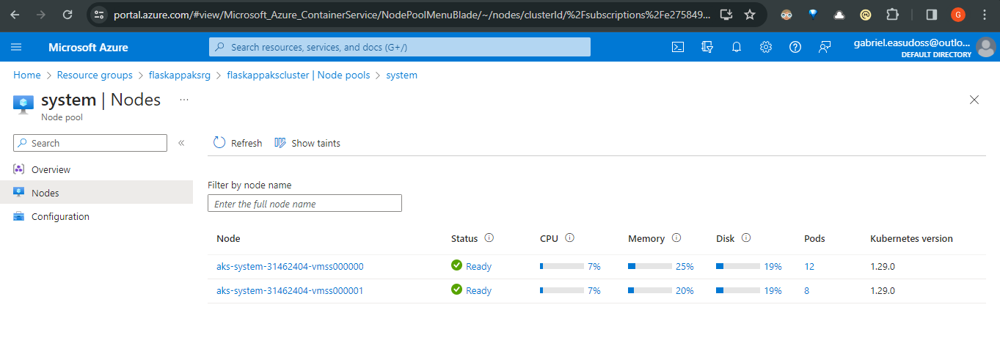

# azure-aks-terraform-webapp-deployment

This code repository demonstrates the deployment of a Flask web application to Azure using Docker containers and Kubernetes. The deployment process includes configuring and deploying supporting infrastructure as code using Terraform. Additionally, the repository includes automation for building and deploying the Flask web application, allowing for easy deployment, destruction, and redeployment of the application and its infrastructure.

1. Deploy a Flask web application to Azure.

      

2. Deploy the Flask web application as a Docker Container.

      

3. Deploy the Docker Container using Kubernetes.

      

4. Any supporting infrastructure is configured and deployed as code - Terraform

      

  I have 2 folders namely for creating Terraform Infarstructure

  - terraform-setup
    - For setting basic Infarstructure for Terraform pipeline namely Storage account to store terraform state etc.
 
      

  - terraform-ask
    - For setting Kubernets and Azure container Registry etc.

      

      

      

5. Any build and deployment automation in deploying the Flask web application.
   - devops-exercise-azure-aks-CI
  
     
      
     
      

     
  - devops-exercise-azure-aks-CD

      

      

      

6. Demonstrating the ability to deploy, destroy, and re-deploy the Flask web application and any supporting infrastructure.

   -  Destory and re-deploy of Infrastructure

       

       

   - Deploy and re-deploy of Website

       

       

       